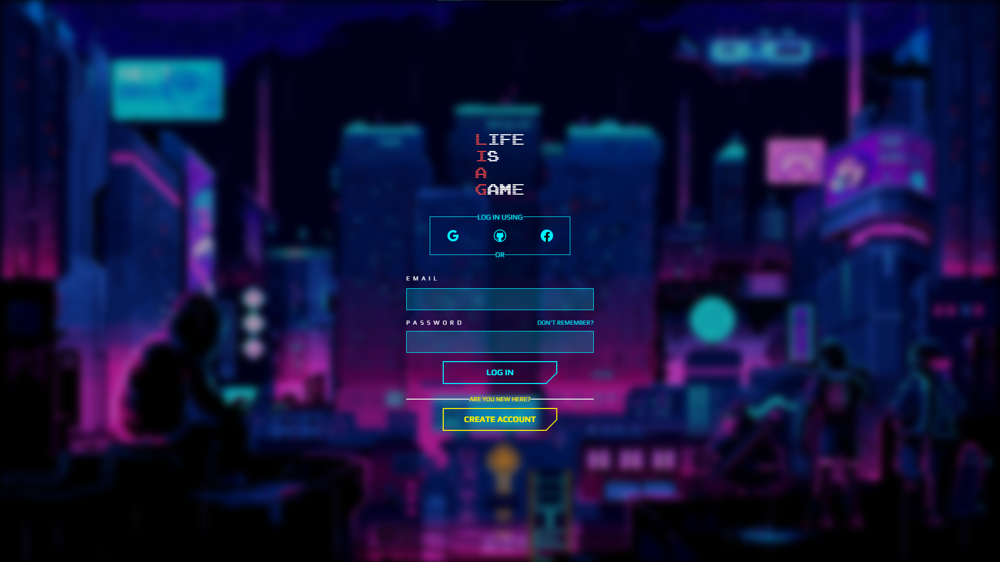
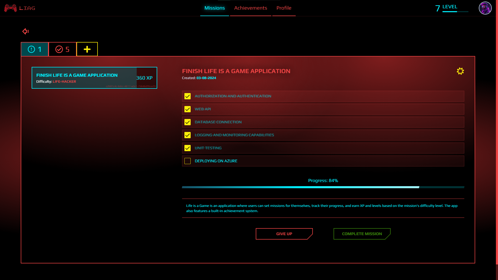
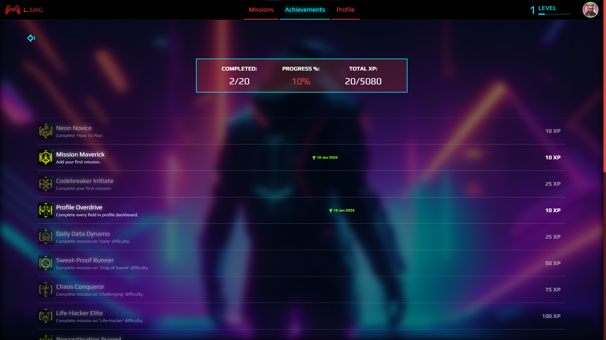
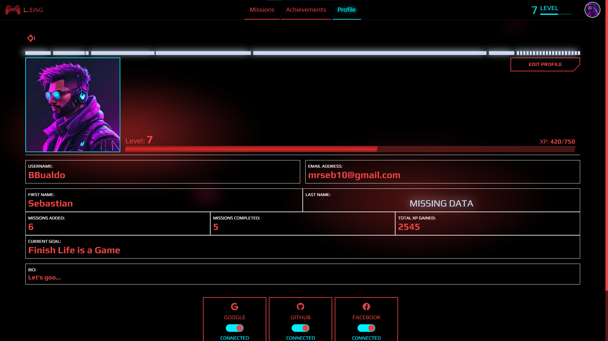
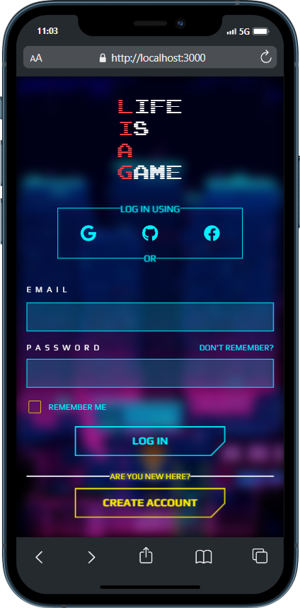
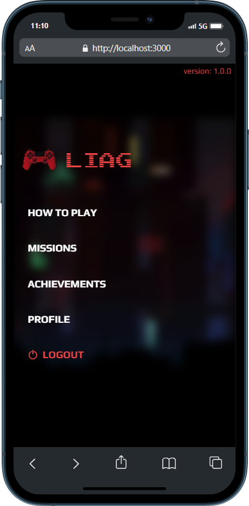
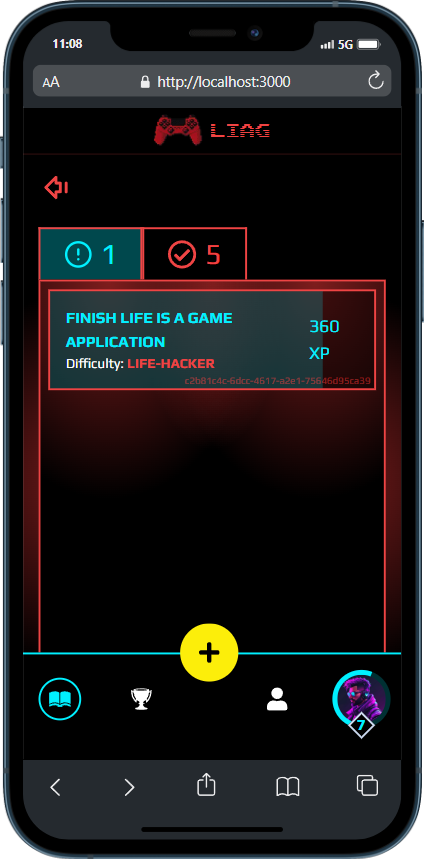
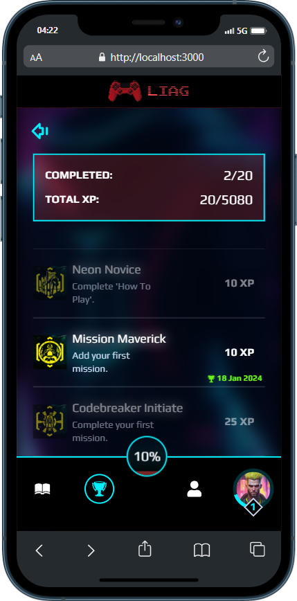
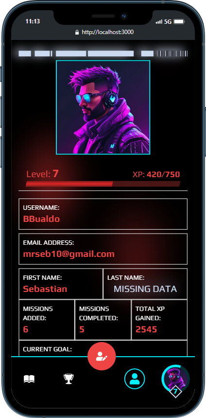

# Life is a Game

This is an application where users can set missions for themselves, track their progress and earn XP and levels based on the mission's difficulty level. The app also features a built-in achievement system.

## Table of contents

- [Overview](#overview)
    - [Screenshots](#-screenshots)
    - [Features](#-features)
- [My process](#my-process)
    - [Built with](#-built-with)
    - [What I have learned](#what-i-have-learned)
    - [Useful resources](#useful-resources)
- [Author](#author)
- [Acknowledgments](#acknowledgments)

## Overview

### 📸 Screenshots

#### Desktop






#### Mobile






### 🧐 Features

- Slider-like tutorial showing main concepts of an app
- Creating, tracking, updating and deleting missions
- Gaining XP and leveling up
- Earning achievements
- Editing profile information (Avatar, Bio, Current Goal, etc.)
- Authentication and Authorization (soon)
- External Providers Auth (Facebook, Google, GitHub) (soon)

## My process

#### Backend implementation
1. Defined Models with Data Annotations and created ```DbContext``` using **Entity Framework Core** with **ASP.NET Identity**.
2. Ensured that Achievements are created on Database creation.
3. Created DTOs for login, register and reset password purpose.
4. Configured **ASP.NET Identity**.
5. ```AuthService``` implementation to store responsibility for actions like login, logout, registering and password recovery. For now, I only implemented methods responsible for login, register and logout. Wondered what these methods should return, so I created ```AuthOperationResult``` class which purpose is to store results of auth operations.
6. Implemented ```AuthController``` with basic authorization endpoints.
7. Created endpoint to get current logged-in user info (```UserDto```).
8. Refactored login and sign-up **Zod schemas** (like including regex validators in password), created ```UserService``` React class and added methods for login and register, which for now are just sending POST request via **Axios** without error and loading handling or routing. Successful response adds token in Cookies. I also had to provide CORS policy.
9. Now the most difficulty part has begun - refactoring half of an existing Next.js/Redux codebase to handle authentication and authorization and make space for existing real database data and for not implemented yet. I started with auth, because it's the hardest and most important thing. I deleted all Redux files except store and created ```authSlice``` to keep currently logged-in user data, which forced me to consider refactoring ```useUser``` hook and every component which uses user data. Furthermore, I have to handle routing unauthorized users to login page and authorized from login page if they try to reach it directly via URL.
10. Handled routes protection using Next.js ```middleware```.
11. Added fetching current user data to form submit logic and configured **Redux-Persist** to keep user data upon refreshing page without need to make extra requests.
12. Added toasts (snackbars) upon successful registering and errors as well. I have also taken care of loading state until request is performed to prevent user from taking any actions like spamming login button, etc.
13. Introduced **RememberMe** checkbox in login form.
14. Updated User to store external providers IDs and deleted **is_unlocked** row from **UserAchievements** table, because record presence is already a sign that achievement is unlocked.
15. Created ```AchievementsRepository```, ```AchievementsService``` and ```AchievementsController``` to get all achievements as well as those unlocked by user, and to unlock specific achievement.
16. Refactored frontend for handling achievements from database. When user logs in and goes into **Achievements** page, React ```useAchievements``` custom hook is calling ```AchievementsService``` for fetching fresh **Achievements** and **UserAchievements** data, saves them in **Redux** state, which is also saved in localStorage. I have mapped **UserAchievements** to JS Map for faster unlocked achievements searching. Then achievements are compared to user achievements to determine, which are unlocked and when. 
17. Created Repository => Service => Controller for **Missions** management. First, I set up assigning missionId Foreign Key in Subtasks manually in Dto object, but then I have made some research about **EF Core Navigation Properties**, so I have added ```public Mission Mission { get; set; }``` into my Subtask Model class. Now it sets missionId automatically. However, I have problem when trying to update Mission with subtasks, probably because lack of subtask management layer, so that's what I was going to do.
18. Assigned empty list to ```List<Subtask>``` in Mission model to avoid nullable checks.
19. When updating mission, I had to insert login to manually determine which subtask exists in mission already, which one is new and which one is missing, so it can be removed. I decided to make subtask ID mandatory for creating new one to simplify the process. I'm going to use **uuid** in React to achieve this.  
20. Created TypeScript ```IMission``` and ```ISubtask``` models as well as DTOs for adding and updating missions purposes, and also ```MissionsService``` class with necessary methods and finally ```useMisssions``` hook to centralize missions data. Then I implemented Redux ```missionsSlice``` and ```selectedMissionSlice``` again. After reworking some variables, filtering and other code parts to fit fresh approach, I've successfully managed displaying missions with all details and selecting missions to work.
21. Refactored ```CreateMissionForm``` and Zod Schema to fit current data expected and returned from API. Adding missions works.
22. Meanwhile, I found out that despite token being present in cookies it can be expired which prevents user from performing authorized operation. Have to keep this in mind and introduce refreshing tokens.
23. Refactored ```EditMissionForm``` and created separate Zod Schema to fit current data expected and returned from API. Updating missions works.
24. Refactored deleting missions.

### 🧰 Built with

- Next.js
- .NET
- TailwindCSS
- RadixUI
- Framer-Motion
- Redux Toolkit
- Redux-Persist
- Axios
- React Hook Form
- Zod
- Typescript
- C#
- ASP.NET Identity
- Entity Framework Core
- SQL Server


### What I have learned

- Difference between ```AddIdentity```, ```AddIdentityCore``` and ```AddDefaultIdentity```.
- Reminded about using ```Maps``` and ```Array.reduce()``` function to sum things up without having to create temporary variable.
- Meaning of **Entity Framework Core** Navigation Properties and that EF is not so good at updating nested objects
- Tokens doesn't disappear from cookies just like in Swagger, they just expire and that has to be handled

### Useful resources
Coming soon...

## Author
Coming soon...

## Acknowledgments
Coming soon...